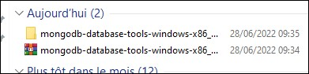
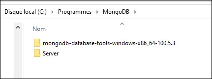
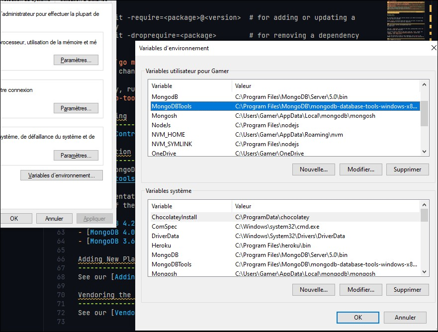
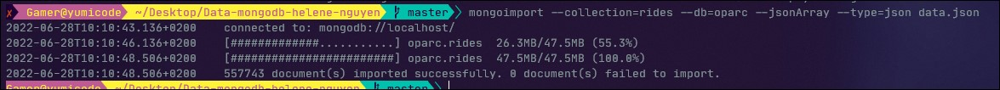

# Download MongoDB Database tools

<https://www.mongodb.com/try/download/database-tools>

To send data json to mongoDB, you have to use the MongoDB Database tools

- Download the file


- Put it in your system file (here, I put it in mongoDB file in Program Files)



- Configure your path



And you can use

```sh
mongoimport --collection=rides --db=oparc --jsonArray --type=json data.json
```


